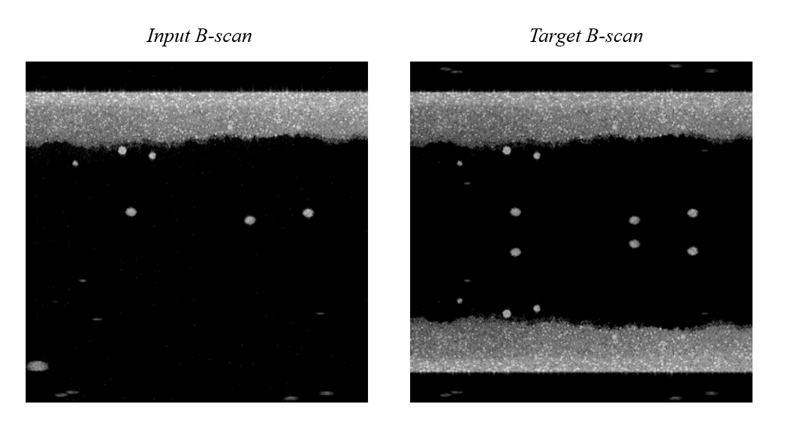

# Eliminación de la Imagen Espejo en FD-OCT mediante Técnicas de Deep Learning

Este repositorio contiene las arquitecturas de redes neuronales propuestas y el preprocesamiento de la base de datos utilizados en el trabajo de grado titulado "Eliminación de la Imagen Espejo en FD-OCT mediante Técnicas de Deep Learning".

## Contenidos
- **Base de datos**:

- **Preprocesamiento de Datos**: Scripts utilizados para preparar la base de datos antes de su uso en el entrenamiento de los modelos.
- **Arquitecturas de Redes Neuronales**: Directorio con los modelos de redes neuronales diseñados para la eliminación de la imagen espejo en FD-OCT.
- 
## Descripción del Proyecto

El objetivo de este proyecto es eliminar las imágenes espejo presentes en las tomografías de coherencia óptica por dominio de frecuencia (FD-OCT) utilizando técnicas avanzadas de Deep Learning. 

1. **Preprocesamiento de Datos**:
    - *Archivo preprocessing.py*: 
    - `dataset_completo`: Procesa los archivos para generar la base de datos con los datos simulados.
    - `dataset_dominios`: Toma el dataset definido y lo reestructura por dominios.
    - `data_solap`: Aumenta los datos de un dataset previamente definido.

2. **Modelos**:
    - Se tienen tres arquitetcuras generales que estan en la carpta carpeta arquitetcuras: Pix2Pix.py, CCARnet.py y cyclegan.py 
     **Experimentos con Modelos**
     - Para las variaciones realizadas estan en en /arquitetcuras/experimentos: pix_opt.py --> prueba de Pix2Pix con diferentes optimizadores. 
     cycle_opt.py --> prueba de CycleGAN con diferentes optimizadores. 
     ccarnet_variaciones.py --> prueba de CCAR Net con diferentes coeficientes en las pérdidas.

    **Otras implementaciones**
     - Para los cambios en f_loss estan en en /arquitetcuras/variaciones:
     pix_loss.py --> . 

2. **Modelos**:
    - 
     **Experimentos con Modelos**

